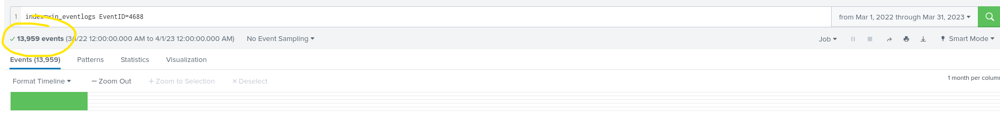
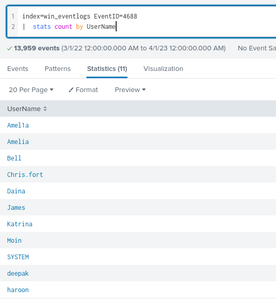
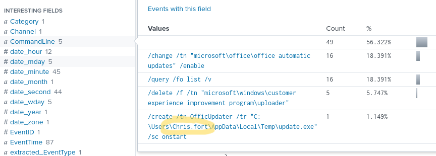
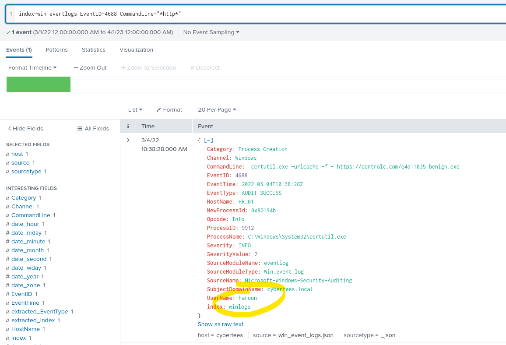
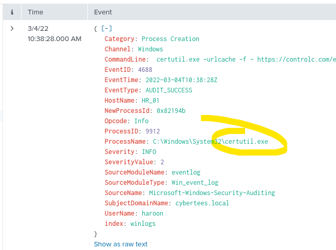
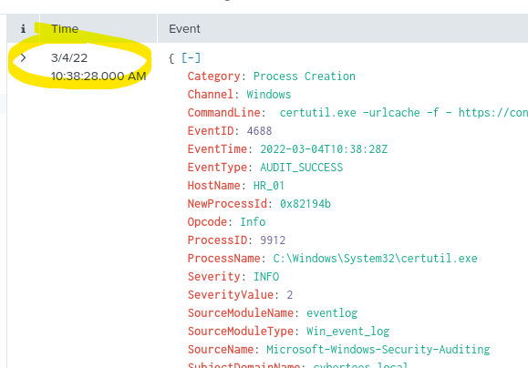
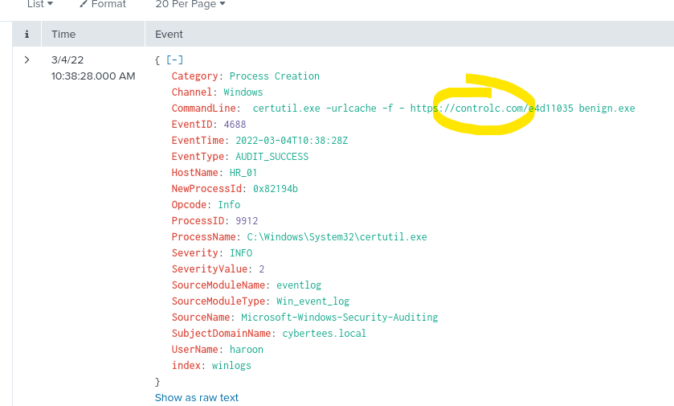
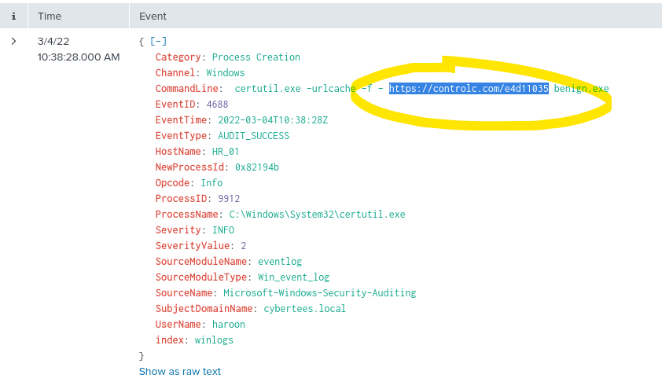
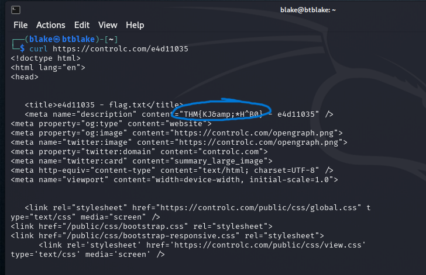

# Benign

# 🕵️ TryHackMe: Benign - Splunk Lab Writeup

## 📝 Overview

This lab investigates a suspected compromise on a host in the HR department. Using Splunk to analyze Windows process creation logs (`Event ID: 4688`), we traced the attacker’s actions from initial access to payload download and post-exploitation. The logs were ingested into the `win_eventlogs` index, and user activity was correlated across departments.

### 🧑‍💼 Network Segmentation

- IT Department: James, Moin, Katrina  
- HR Department: Haroon, Chris, Diana  
- Marketing Department: Bell, Amelia, Deepak   
---

## ❓ Questions & Answers

**1️⃣ How many logs are ingested from the month of March, 2022?**  
Make sure the correct dates are set and we're in the correct index with the correct event ID.

`13,959`

**2️⃣ Imposter account observed in the logs:** 
Here I listed all the usernames, this will make it easier to find the oddball with a "stats query".

`Amel1a`

**3️⃣ Which HR user ran scheduled tasks?**  
Going back to our main search with no EventID, search for anything related to "*tasks*" or "*schtasks*"

`Chris.fort`

**4️⃣ Which HR user executed a system process to download a payload?**  
Here we'll want to see any commands pulling from "*http*" since we're downloading from somewhere. 

`Haroon`

**5️⃣ What system process (LOLBIN) was used?**  
I noticed I could use the same event for the next few questions, the system process is listed here as well

`certutil.exe`

**6️⃣ Execution date of the binary:**  

Pretty straight forward, I found the date and changed the format.

`2022-03-04`

**7️⃣ Third-party site used for payload download:**  

Within the command line itself, no hiding it in base64 this time.

`controlc.com`

**8️⃣ Name of file saved on the host machine:**  
This will be the one being downloaded from the third party site which I can see is:

`benign.exe`

**9️⃣ Malicious content/flag pattern:**  

For this, I wasn't able to find it with Splunk, I'm not sure if I was suppose to or not but I ended up curling the download page and we get the flag that is HTML encoded, once it's decoded I'll have the answer.

`THM{KJ&*H^B0}`

**🔟 Full URL connected to:**  

`https://controlc.com/e4d11035`

---

## 🧩 Summary

Through Splunk analysis, we uncovered a malicious payload downloaded using `certutil.exe` by the HR user `Haroon`. A scheduled task was also configured by `Chris.fort`, indicating persistence. The attacker used an external paste site to host the payload and accessed it via a known LOLBIN. Indicators like the imposter user `Amel1a` further confirmed lateral movement and impersonation attempts.

---

